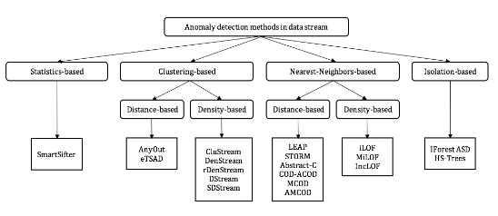

# Détection d'Anomalies

les 3 techniques pour la détection d’anomalies

1. iForestASD_Streaming_Scikit-MultiFlow

2. skmultiflow_IForestASD

3. streaming-online-learning

## [iForestASD_Streaming_Scikit-MultiFlow](Notebook_test_iForestASD_Scikitmultiflow.ipynb)
[**iForestASD_Streaming_Scikit-MultiFlow.py**](python/iforestasd_scikitmultiflow.py)

## [Streaming-Online-Learning](https://github.com/MariamBARRY/streaming-online-learning)

Ce référentiel est l'implémentation officielle de l'article Online Learning Deployment for Streaming Applications in the Banking Sector (Barry, Montiel, Bifet, Chiky, Shakman, Manchev, Wadkar, El Baroudi, Tran, KDD 2021). Les ressources peuvent être utilisées pour configurer et déployer des instances de modèles d'apprentissage automatique en ligne, pour générer des prédictions et mettre à jour les poids du modèle sur les données en continu.

> **Motivations :** L'objectif est de proposer une plate-forme pour fournir un pont transparent entre les activités centrées sur la science des données et les activités d'ingénierie des données, de manière à satisfaire à la fois les contraintes de production imposées en termes d'évolutivité et les exigences des applications de streaming en termes d'apprentissage en ligne. Des exemples de cas d'utilisation potentiels peuvent être la détection d'anomalies et de fraudes pour les flux de données évoluant dans le temps ou la classification en temps réel des activités des utilisateurs ou des événements informatiques ou de journaux. Cela peut être un véritable accélérateur pour gagner en pro-activité dans la résolution de problèmes réels.

**Outils : RIVER, Kafka & Domino Platform on AWS**
> River est une bibliothèque d'apprentissage automatique en ligne open source écrite en Python dont l'objectif principal est l'apprentissage incrémentiel d'instance, ce qui signifie que chaque composant (estimateurs, transformateurs, métriques de performance, etc.) est conçu pour être mis à jour un échantillon à la fois. . Nous avons utilisé River pour former et mettre à jour en continu le modèle d'apprentissage en ligne à partir des derniers flux de données. KAFKA est une plate-forme de streaming d'événements distribués open source à la pointe de la technologie et nous avons utilisé un Kafka hébergé géré (confluent). Nous l'avons utilisé comme générateur de flux de données.

>La plate-forme Domino Platform est implémentée au-dessus de Kubernetes, où elle fait tourner des conteneurs à la demande pour exécuter les charges de travail des utilisateurs. Les conteneurs sont basés sur des images Docker, qui sont entièrement personnalisables. Nous avons utilisé Domino pour héberger les modèles et exécuter des tests d'évolutivité sur des données à haute vitesse générées sous forme de flux.

## Quelques définitions 

> **MicroPython :** 
>> MicroPython est une implémentation légère et efficace du langage de programmation Python 3 qui inclut un petit sous-ensemble de la bibliothèque standard Python et est optimisée pour s'exécuter sur des microcontrôleurs et dans des environnements contraints.

>> Le pyboard MicroPython est une carte électronique compacte qui exécute MicroPython sur le métal nu, vous offrant un système d'exploitation Python de bas niveau qui peut être utilisé pour contrôler toutes sortes de projets électroniques.

>> MicroPython regorge de fonctionnalités avancées telles qu'une invite interactive, des entiers de précision arbitraires, des fermetures, la compréhension de liste, des générateurs, la gestion des exceptions, etc. Pourtant, il est suffisamment compact pour s'adapter et fonctionner dans seulement 256 Ko d'espace de code et 16 Ko de RAM.

>> MicroPython vise à être aussi compatible que possible avec Python normal pour vous permettre de transférer facilement du code du bureau vers un microcontrôleur ou un système embarqué.

> **scikit-multiflow :**
>>Apprentissage incrémental : Les modèles d'apprentissage par flux sont créés progressivement et mis à jour en permanence. Ils conviennent aux applications Big Data où la réponse en temps réel est vitale.

>>Apprentissage adaptatif : Les changements dans la distribution des données nuisent à l'apprentissage. Les méthodes adaptatives sont spécifiquement conçues pour être robustes aux changements de dérive de concept dans des environnements dynamiques.

>>Efficace sur le plan des ressources : Les techniques de streaming gèrent efficacement les ressources telles que la mémoire et le temps de traitement étant donné la nature illimitée des flux de données.

>>Facile à utiliser : scikit-multiflow est conçu pour les utilisateurs de tout niveau d'expérience. Les expériences sont faciles à concevoir, à configurer et à exécuter. Les méthodes existantes sont faciles à modifier et à étendre.

>>Outils d'apprentissage en streaming : Dans son état actuel, scikit-multiflow contient des générateurs de données, des méthodes d'apprentissage de flux multi-sorties/multi-cibles, des méthodes de détection de changement, des méthodes d'évaluation, etc.

> **tinyML :** 
>> L'apprentissage automatique minuscule (**tinyML**) est généralement défini comme un domaine en croissance rapide des technologies et des applications d'apprentissage automatique, y compris le matériel (circuits intégrés dédiés), les algorithmes et les logiciels capables d'effectuer des analyses de données de capteurs sur l'appareil (vision, audio, IMU, biomédical, etc.) à une puissance extrêmement faible, généralement dans la plage des mW et moins, et permettant ainsi une variété de cas d'utilisation toujours actifs et ciblant les appareils fonctionnant sur batterie.

>> Le premier sommet tinyML en mars 2019 a montré un très vif intérêt de la part de la communauté avec la participation active d'experts seniors de 90 entreprises. Il a révélé que : 

>>> (i) le petit matériel capable d'apprendre par machine devient "assez bon" pour de nombreuses applications commerciales et de nouvelles architectures (par exemple, le calcul en mémoire) sont à l'horizon ; 
 
>>> (ii) des progrès significatifs sur les algorithmes, les réseaux et les modèles jusqu'à 100 Ko et moins ; 

>>> (iii) les applications initiales à faible puissance dans l'espace de la vision et de l'audio. Il y a une dynamique croissante démontrée par le progrès technique et le développement de l'écosystème.

>> La communauté tinyML continue de croître grâce à de multiples événements de haute qualité   
>> – en personne et en ligne   
>> – tout au long de l'année,   
>> notamment le sommet tinyML, tinyML EMEA, tinyML Asia, tinyML Talks et les meetups tinyML.

> **Machine Learning :**
>> **Concept général :** Le machine learning (apprentissage automatique) est au cœur de la science des données et de l’intelligence artificielle. Que l’on parle de transformation numérique des entreprises, de Big Data ou de stratégie nationale ou européenne, le machine learning est devenu incontournable. Ses applications sont nombreuses et variées, allant des moteurs de recherche et de la reconnaissance de caractères à la recherche en génomique, l’analyse des réseaux sociaux, la publicité ciblée, la vision par ordinateur, la traduction automatique ou encore le trading algorithmique. À l’intersection des statistiques et de l’informatique, le machine learning se préoccupe de la modélisation des données.

>> **Apprentissage Non Supervisé :** C’est l’apprentissage automatique où les données ne sont pas étiquetées, c’est à dire n’ont pas de classe. Il s’agit donc de découvrir les structures sous-jacentes à ces données non étiquetées. Puisque les données ne sont pas étiquetées, il est impossible à l’algorithme de calculer de façon certaine un score de réussite. Mais, cette approximation reste très utile dans les domaines du quotidient. Ce type d’apprentissage se matérialise sous forme d’algorithmes, qui, en se basant sur certaines règles de mathématiques arrivent à classer les éléments non connus. Parmi ces algorithmes, on arrive à reconnaître celui nommé Isolation Forest.

> **L'algorithme Isolation Forest (IForest) :**
>> **Présentation :** La plupart des algorithmes de détection d’anomalie tel que « Replicator Neural Network » [Williams et al. 2002], classification-based methods » [Abe et al. 2006 ; Shi and Horvath 2006], Replicator Neural Network (RNN) [Williams et al. 2002], one-class SVM [Tax et Duin 2004] et clustering-based methods [He et al. 2003] génèrent un modèle du profil normal des instances de la base de données et ensuite identifient lesquelles sont les instances qui ne sont pas conformes au modèle. Cette approche nécessite une analyse statistique où un calcule de distance dans toute la base de données. C’est pourquoi, ces algorithmes sont très coûteux de point de vue performance. Ce qui limite la taille de la base de données à utiliser. La capacité de détection des anomalies de cette approche est un sous-produit d’un algorithme conçu pour la classification où le clustering de données ce qui engendre une faible performance de l’algorithme, ce qui est traduit par un grand nombre d’instances mal identifiées. Contrairement à ces algorithmes, L’algorithme IForest propose une approche différente qui cherche à identifier directement les anomalies tout en limitant les calculs réalisés. Cette approche utilise la structure des arbres binaire de décision pour représenter les données.

>> **Notion d’Arbre et d’arbre de Décision :** En théorie de graphe, un arbre est un graphe qui constitue des points appelés nœuds liées à travers des arc. L’ensemble des nœuds se divise en trois catégories :
>>- Nœud racine (l’accès à l’arbre se fait par ce nœud),
>>- Nœuds internes : les nœuds qui ont des descendants (ou enfants), qui sont à leur tour
des nœuds,
>>- Nœuds terminaux (ou feuilles) : nœuds qui n’ont pas de descendant.
En informatique l’arbre correspond à une structure de donnée qui représente les don-
nées en tant que nœuds liés.
Le chemin d’un nœud représente l’ensemble des nœuds parcourue à partir de la racine.
Notons la taille du chemin d’un nœud x : h(x). Il existe plusieurs types d’arbres tel que
l’arbre binaire, arbre de décision. Nous nous intéressons dans notre projet à l’arbre bi-
naire de recherche et à l’arbre de décision.

>>-> Un arbre binaire de recherche est un arbre où chaque nœud possède au plus deux
nœuds fils.

>>-> Un arbre binaire strict est un arbre binaire où chaque nœud interne possède deux
nœuds fils.

>> **Principe :** Le principe de l’approche IForest est basé sur les caractéristiques fondamentales des anomalies : ces instances sont une minorité dans la base et elles présentent des attributs distinctes des autres instances. Par conséquent, les anomalies sont très susceptibles au mécanisme d’Isolation. Ce mécanisme consiste à la séparation d’une instance des autres. En générale, une approche fondée sur l’isolation mesure la susceptibilité de l’instance à
être isolée. Afin d’évaluer cette susceptibilité, l’approche IForest génère des arbres binaires strictes nommés arbre d’isolation où chacun des nœuds fils correspond à une partition de l’ensemble du nœud parent. En d’autres termes, l’algorithme réalise récursivement un split aléatoire de l’ensemble. Par conséquent les instances susceptibles à l’isolation nécessiteront généralement moins de partitionnement que les autres instances ce qui se traduit dans
l’arbre par une taille du chemin plus court en moyenne que les autres.

>> **Algorithme :** On décrit dans cette section l’implémentation de l’algorithme IForest. Cet algorithme est divisé en deux phases. La première phase d’entraînement est responsable de la construction des arbres d’isolation. La deuxième phase, phase d’évaluation, calcule les tailles des chemins moyens de l’instance et calcule un score d’évaluation qui détermine quelles sont les anomalies.

>> **Métrique :** Pour évaluer la performance d’un algorithme dans une base de données nous avons choisi 4 métriques d’évaluation.
>>- (a) Accuracy est le pourcentage d’instance prédit correctement dans un ensemble
>>- (b) F-score est une mesure engendrée de la précision et le rappel
>>- (c) AUC ROC est la courbe ROC représente la courbe associée à la variation du TPR par le FPR. La AUC de la courbe ROC est la surface de l’espace limité par la courbe. Elle représente la probabilité qu’une instance qui appartient à notre classe possédera un score moins que celle d’une instance qui n’appartient pas. Si la valeur du AUC est égal à 0.5, alors notre modèle n’a pas de moyen de distinction entre l’appartenance ou non à notre classe. Son
choix est aléatoire. Donc l’AUC ROC permet d’évaluer le potentiel du modèle à prédire. Il est clair que l’ AUC ROC n’est pas susceptible de la valeur du seuil de distinction

# Mise au Point

## 1. Concepts et notions

La détection d'anomalies est une branche du forage de données qui s'occupe de l'identification des enregistrements atypiques ou des occurrences rares dans les
données (Tan et al., 2006). En d'autres termes, la détection d'anomalies consiste à trouver les objets qui sont différents ou inconsistants par rapport à la majorité des objets d 'un jeu de données. Dans la littérature, les objets atypiques détectés sont dits anomalies, et sont aussi appelés, selon le contexte d'application, exceptions, surprises ou outliers (Aggarwal, 2017).

Initialement, la détection d'anomalies s'est développée dans les données à vecteur de caractéristiques. Formellement, la première définition d'anomalie revient à Hawkins en 1980 : "Une anomalie est une observation qui diffère tellement d'autres observations au point d'éveiller des soupçons qu'elle soit générée par un mécanisme différent" (Hawkins, 1980). 
Étant donnée la force d'expressivité des graphes et leur capacité à représenter des relations complexes entre les entités du monde réel, la notion d'anomalie s'est généralisée au cas des données représentées par des graphes. En effet, "dans un graphe, une anomalie peut être définie par les objets qui sont rares et qui diffèrent significativement de la majorité des objets de référence ." (Akoglu et al. , 2015). Ici , un objet de référence est un objet qui se caractérise par un comportement ou par un état normal attendu.

La définition d'anomalie prend plus de sens lorsqu'elle est reliée à un contexte ou à une application bien spécifique. Particulièrement , la détection d'anomalies a été beaucoup appliquée pour dans la détection de fraude. Par ailleurs, la détection d'anomalies s'emploie aussi dans la détection des intrusions dans les réseaux d'ordinateurs. 

## 2. Détection d'anomalies dans les données vectorielles

La technique de détection d'anomalies dans les données vectorielles peuvent être catégorisées en trois types : méthodes à base de statistiques, méthodes à base de distance et méthodes à base de densité. 

### 2.1 Méthodes à base de statistiques

Les approches à base de statistiques consistent à élaborer des modèles statistiques probabilistes flexibles qui représentent la distribution des jeux de données testés comme les modèles gaussiens (Yamanishi et al., 2004) et les modèles de régression (Aggarwal, 2005) , (Li et Han , 2007). Le degré d'anomalie d'un objet particulier est évalué par rapport à sa conformité au modèle établi. Particulièrement, dans (Yamanishi et al., 2004), un modèle de mélange gaussien est proposé pour représenter la distribution des données testées. Chaque objet reçoit un score d'anomalie qui caractérise sa déviation au modèle. Un score élevé dénote une forte probabilité que l'objet en question soit une anomalie.

### 2.2 Méthodes à base de distance

Les méthodes à base de distance consistent à calculer la disparité entre les objets d'un ensemble de données. Pour mesurer l'hétérogénéité des objets, plusieurs métriques peuvent être employées comme la distance euclidienne et la distance de Manhattan. Un objet est considéré une anomalie s'il est remarquablement distant de la majorité d'objets.
Spécifiquement les techniques à base de distance comme k plus proches voisins (Ramaswamy et al. , 2000) et KNN-pondéré (Angiulli et Pizzuti, 2002) assignent un score d'anomalie à chaque objet en se basant sur ses k plus proches voisins. De cette manière, étant distants , les anomalies ( outliers) reçoivent des scores élevés et les objets normaux ( inliers) reçoivent des scores faibles. 
Les anomalies sont discernées en triant les scores dans un ordre ascendant et en sélectionnant les observations ayant les scores les moins élevés.

### 2.3 Méthodes à base de densité

Les méthodes à base de densité mesurent le degré d'anomalie d'un objet en considérant la densité locale de son voisinage. Spécifiquement, l'exemple de calcul du score d'anomalie LOF (Local Outlier Factor) (Breunig et al., 2000). Le fondement de LOF a été inspiré de la méthode de partitionnement à base de densité DBSCAN qui identifie à la fois les communautés et les outliers (Ester et al., 1996). 
Dans LOF, la densité locale de chaque objet se calcule en respect de ses k plus proches voisins. L'ensemble des distances d'un objet particulier à ses k plus proches voisins sont utilisées dans le calcul de sa densité locale. Les densités locales de tous les objets sont, ensuite, évaluées pour déterminer les régions de densité similaires et les objets outliers qui détiennent des densités locales remarquablement faibles par rapport à leurs voisinages. 
Les techniques présentées dans cette section ne représentent pas une liste exhaustive des méthodes de détection d'anomalies dans les données vectorielles. 

## 3. Détection d'anomalies dans les graphes

Un grand intérêt a été porté à l'élaboration de techniques qui traite les anomalies dans les graphes, et ce vu leur expressivité et leur capacité à représenter la complexité d'interaction du monde réel (Akoglu et al., 2015). Les techniques présentées dans la suite de cette section, discernent les anomalies à partir de la structure topologique d'un graphe monodimensionnel.
La topologie d'un réseau est porteuse d'informations implicites décisives pour repérer les anomalies. À titre d'exemple, dans les réseaux sociaux, plusieurs types d'anomalies peuvent avoir lieu (Savage et al., 2014). Particulièrement, les spammeurs sont incapables de cacher un certain type de métadonnées telles que leurs patrons d'interactions, c'est-à-dire, les liens qu'ils établissent et qui sont, entre autres, révélateurs de leur comportement irrégulier. Pour identifier ces acteurs malveillants du réseau, l'utilisation unique des données est insuffisante et il est nécessaire de considérer la structure topologique du réseau. Dans (Fathaliani et Bouguessa, 2015), un score d'anomalie qui évalue la proportion des liens émis et des liens reçus a été proposé pour identifier ce type d'utilisateurs malintentionnés.
À cela s'ajoute, dans les graphes, la détection de communautés qui a été appliquée pour la détection des intrusions dans les réseaux (Ding et al. , 2012). En effet, la détection de communautés (appelée aussi partitionnement) compte parmi les problématiques les plus étudiées dans les graphes. Explicitement, la détection de communautés consiste à découvrir la structure sous-jacente d'un réseau à savoir l'identification des nœuds fortement connectés entre eux (c'est-à-dire, les clusters). Dans ce contexte, les intrusions sont les nœuds présents dans une communauté, mais qui n'y appartiennent pas réellement. D'autres techniques de détection de communautés se sont concentrées sur l'identification des nœuds superflus (outliers) qui sont marginalement connectés aux communautés. Ces nœuds forment un bruit dans le réseau et leur élimination peut, potentiellement, améliorer les résultats d'analyse. Un nombre d'algorithmes a été proposé à ce suj et, à savoir SCAN (Xu et al., 2007), gSkeletonClu (Huang et al., 2013) et SHRINK (Huang et al., 2010). L'algorithme SCAN détecte les communautés et les nœuds qui y sont marginalement connectés en se basant sur une métrique de similarité structurale qui se calcule entre les nœuds du graphe. Cette métrique tient compte de la connectivité entre les nœuds, et ce en examinant leurs voisinages. Plus les nœuds partagent des voisins, plus la valeur de la métrique de similarité est élevée. Pour déterminer les communautés et les outliers, un seuil minimal de similarité doit être fixé. De cette manière, les nœuds qui ont plusieurs voisins en commun se groupent dans une même communauté. Par ailleurs, les nœuds superflus sont les nœuds qui ne se sont pas affectés à des communautés et qui ont des valeurs de similarité faibles.
L'algorithme SCAN nécessite un paramétrage pour pouvoir identifier les communautés et les nœuds superflus. Pour éviter cette intervention supervisée, l'algorithme gSkeletonClu a été proposé. Il convient de préciser que, tout comme SCAN, l'algorithme gSkeletonClu est un algorithme de partitionnement à base de densité qui détermine aussi bien les communautés tous les outliers selon une métrique de similarité. Toutefois, l'algorithme gSkeletonClu permet une sélection automatique de la valeur du seuil minimal, et ce en maximisant une mesure de validité comme la modularité. La modularité est une métrique fréquemment utilisée pour mesurer la qualité de partitionnement d'un graphe. Quelques algorithmes comme gSkeletonClu utilisent cette métrique comme une fonction objective pour optimiser le partitionnement d'un graphe. Ici, il est utile de noter que , dans gSkeletonClu, l'extraction des communautés et des outliers peut se faire aussi avec un seuil spécifié à l'avance par l'utilisateur.
Dans la littérature, nous trouvons, également, SHRINK qui est un algorithme de partitionnement hiérarchique. Cet algorithme identifie les communautés et les outliers sans la nécessité de paramétrage en reposant sur le principe de réduction. Plus précisément, l'algorithme commence par identifier les pairs de nœuds denses, c.-à-d. les nœuds dont la similarité structurale est maximale par rapport à leurs voisinages. Ensuite, une fusion se fait entre les pairs de nœuds denses identifiés pour construire itérativement des microcommunautés. De ce fait, une microcommunauté peut être un nœud isolé ou un sous-graphe d'un ou plusieurs pairs de nœuds denses connectés. Au fur et à mesure des itérations, un arbre hiérarchique d'emboîtement des microcommunautés se construit.

## 4. Isolation-Based

Le principe de l'isolation-based approche consiste à isoler les observations anormales de l'ensemble de données. Données d'anomalies sont censés être très différents des normaux. Ils sont également censés représentent une très petite proportion de l'ensemble des données. Ainsi, ils sont susceptibles d'être rapidement isolé. Certaines méthodes sont basées sur l'isolement. Les méthodes basées sur l'isolement sont différentes des autres statistiques, clustering ou plus proches approches voisines car elles ne calculent pas une distance ou une densité à partir de l'ensemble de données. Par conséquent, ils ont une complexité moindre et sont plus évolutifs. Ils ne souffrent pas du problème de CPU, de mémoire ou de consommation de temps. Ainsi, les méthodes basées sur l'isolation sont adaptées au contexte du flux de données.

## 5. Deep learning 

il représente une classe d’algorithmes d’apprentissage automatique supervisé ou non supervisé basés sur l’utilisation de plusieurs couches d’unité de traitement non linéaire. Parmi ces méthodes on cite les auto-encoders (AE) et One-Class Neural Networks (OC-NN) (Chalapathy et Chawla (2019)).

## 6. Autres techniques

Basées sur les machines à vecteurs de support (Schölkopf et al. (2000)), les réseaux de neurones (Hodge et Austin (2004)), les méthodes adaptées aux grandes dimensions par construction de sous-espaces ou par réduction de dimension (Aggarwal (2017)).

## 7. Récapitulatif de la Classification des différentes techniques de détection d’anomalies

 <!--  -->

       
         

## 8.Classification of data stream anomaly detection methods

       
         

## Méthodes  expérimentales de détection d’anomalies très utilisées dans la littérature

Méthodes se basant à la fois sur le type de jeux de données (flux, séries temporelles, graphes, etc.), le domaine d’application et l’approche considérée (statistique, classification, clustering, etc.). Trois algorithmes : 
- **LOF**, Local Outlier Factor (LOF) est une méthode phare de la détection d’anomalies locales basée sur la densité de l’observation en question par rapport à la densité de ses plus proches voisins. Proposée par Breunig et al. (2000), LOF est une méthode non supervisée qui donne un score représentant le degré d’aberrance de l’observation. Les observations dont le degré d’aberrance est largement supérieur à 1 sont considérées comme anomalies. 
- **OC-SVM**, One-Class Support Vector Machine (OC-SVM) est une méthode de détection d’anomalies qui applique des algorithmes de SVM au problème de One class classification (OCC) proposée par Schölkopf et al. (2000, 2001). Le séparateur à vaste marge (SVM) appelé aussi machine à vecteurs de support est très utilisé pour l’apprentissage automatique du fait de sa puissance et de sa polyvalence (classification linéaire, non-linéaire, régression). OCC est une approche de classification semi-supervisée qui consiste à repérer toutes les observations appartenant à une classe précise connue pendant l’apprentissage, dans tout le jeu de données. L’idée clé de cette méthode est de trouver un hyperplan dans un espace de grande dimension qui sépare les anomalies des données normales.
- **Isolation Forest**, IForest est une méthode basée sur les arbres de décision et les forêts aléatoires (Liu et al. (2008, 2012)). Elle utilise l’isolation d’observations à partir de la construction de plusieurs arbres aléatoires. Quand une forêt d’arbres aléatoires et indépendants produit collectivement un chemin d’accès court pour atteindre une observation depuis la racine, celle-ci a une forte probabilité d’être une anomalie. Le nombre d’arbres utilisés est donc un important paramètre pour IForest. Le seuil de la détection est aussi un paramètre clé, il est donné par le score calculé pour chaque observation relativement aux autres observations.

Nous privilégierons une approche basée sur l'isolement : Isolation Forest.

À ce propos vérifions si ces programmes en langage C++ ne traitent pas déjà la question

  1. [ISOTREE](https://github.com/antaresatlantide/anomalie-detection/blob/main/isotree.md)
  2. [LIBISOLATIONFOREST](https://github.com/antaresatlantide/anomalie-detection/blob/main/LibIsolationForest.md)
  3. [RANGER](https://github.com/antaresatlantide/anomalie-detection/blob/main/ranger.md)
  4. [Machine Learning From Scratch with C++](https://github.com/antaresatlantide/anomalie-detection/blob/main/MLfromcrashcpp.md)
     - 4.1 [K-Means](https://github.com/antaresatlantide/anomalie-detection/blob/main/MLfromcrashcpp.md)
     - 4.2 [K-NN](https://github.com/antaresatlantide/anomalie-detection/blob/main/MLfromcrashcpp.md)
     - 4.3 [Regression Trees](https://github.com/antaresatlantide/anomalie-detection/blob/main/MLfromcrashcpp.md)
    
  
