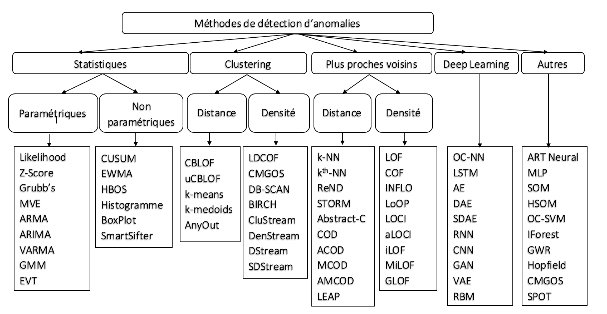

# Anomalie-Detection

Dans la continuation de notre travail avec Kimura, nous allons maintenant passer au data stream anomaly detection problem.

Il y a en gros 3 techniques pour a détection d’anomalies, qui sont parfaitement résumées dans le papier suivant qui attaque la question du « online » (comme nous pour le clustering) : https://hal.archives-ouvertes.fr/hal-02874869v2/file/IForestASD_ScikitMultiflow_Version2_PourHAL.pdf

Il faudrait faire une implémentation en C de ce qui est proposé dans cet article. Sans doute en réduisant la dimension des données en entrée qui pourraient être des données 2D comme on a fait pour le clustering.

Notre fond de commerce c’est de pouvoir exécuter sur des devices comme celui de Terasic mentionné ci-après. Tu vas reconnaître des SDK pour ce type de board.

L’article sur HAL, lui, suppose que nous travaillons dans l’écosystème Python (voir la communauté Tinyml (https://www.tinyml.org/) , voir micropython (https://micropython.org/), voir river cité dans l’article https://github.com/online-ml/river/ et https://scikit-multiflow.github.io/). C’est la vision un peu orthogonale à la notre. Nous n’allons pas aller dans cette direction.

# Résultats de nos RECHERCHES

## 1. Concepts et notions

La détection d'anomalies est une branche du forage de données qui s'occupe de l'identification des enregistrements atypiques ou des occurrences rares dans les
données (Tan et al., 2006). En d'autres termes, la détection d'anomalies consiste à trouver les objets qui sont différents ou inconsistants par rapport à la majorité des objets d 'un jeu de données. Dans la littérature, les objets atypiques détectés sont dits anomalies, et sont aussi appelés, selon le contexte d'application, exceptions, surprises ou outliers (Aggarwal, 2017).

Initialement, la détection d'anomalies s'est développée dans les données à vecteur de caractéristiques. Formellement, la première définition d'anomalie revient à Hawkins en 1980 : "Une anomalie est une observation qui diffère tellement d'autres observations au point d'éveiller des soupçons qu'elle soit générée par un mécanisme différent" (Hawkins, 1980). 
Étant donnée la force d'expressivité des graphes et leur capacité à représenter des relations complexes entre les entités du monde réel, la notion d'anomalie s'est généralisée au cas des données représentées par des graphes. En effet, "dans un graphe, une anomalie peut être définie par les objets qui sont rares et qui diffèrent significativement de la majorité des objets de référence ." (Akoglu et al. , 2015). Ici , un objet de référence est un objet qui se caractérise par un comportement ou par un état normal attendu.

La définition d'anomalie prend plus de sens lorsqu'elle est reliée à un contexte ou à une application bien spécifique. Particulièrement , la détection d'anomalies a été beaucoup appliquée pour dans la détection de fraude. Par ailleurs, la détection d'anomalies s'emploie aussi dans la détection des intrusions dans les réseaux d'ordinateurs. 

## 2. Détection d'anomalies dans les données vectorielles

Le techniques de détection d'anomalies dan les données vectorielles peuvent être catégorisées en trois types : méthodes à base de statistiques, méthodes à base de distance et méthodes à base de densité. 

### 2.1 Méthodes à base de statistiques

Les approches à base de statistiques consistent à élaborer des modèles statistiques probabilistes flexibles qui représentent la distribution des jeux de données testés comme les modèles gaussiens (Yamanishi et al., 2004) et les modèles de régression (Aggarwal, 2005) , (Li et Han , 2007). Le degré d'anomalie d'un objet particulier est évalué par rapport à sa conformité au modèle établi. Particulièrement, dans (Yamanishi et al., 2004), un modèle de mélange gaussien est proposé pour représenter la distribution des données testées. Chaque objet reçoit un score d'anomalie qui caractérise sa déviation au modèle. Un score élevé dénote une forte probabilité que l'objet en question soit une anomalie.

### 2.2 Méthodes à base de distance

Les méthodes à base de distance consistent à calculer la disparité entre les objets d'un ensemble de données. Pour mesurer l'hétérogénéité des objets, plusieurs métriques peuvent être employées comme la distance euclidienne et la distance de Manhattan. Un objet est considéré une anomalie s'il est remarquablement distant de la majorité d'objets.
Spécifiquement les techniques à base de distance comme k plus proches voisins (Ramaswamy et al. , 2000) et KNN-pondéré (Angiulli et Pizzuti, 2002) assignent
un score d'anomalie à chaque objet en se basant sur ses k plus proches voisins. De cette manière, étant distants , les anomalies ( outliers) reçoivent des scores élevés et les objets normaux ( inliers) reçoivent des scores faibles. Les anomalies sont discernées en triant les scores dans un ordre ascendant et en sélectionnant les observations ayant les scores les moins élevés.

### 2.3 Méthodes à base de densité

Les méthodes à base de densité mesurent le degré d'anomalie d'un objet en considérant la densité locale de son voisinage. Spécifiquement, l'exemple de calcul du score d'anomalie LOF (Local Outlier Factor) (Breunig et al., 2000). Le fondement de LOF a été inspiré de la méthode de partitionnement à base de densité DBSCAN qui identifie à la fois les communautés et les outliers (Ester et al., 1996). Dans LOF, la densité locale de chaque objet se calcule en respect de
ses k plus proches voisins. L'ensemble des distances d'un objet particulier à ses k plus proches voisins sont utilisées dans le calcul de sa densité locale. Les densités locales de tous les objets sont, ensuite, évaluées pour déterminer les régions de densité similaires et les objets outliers qui détiennent des densités locales remarquablement faibles par rapport à leurs voisinages. 
Les techniques présentées dans cette section ne représentent pas une liste exhaustive des méthodes de détection d'anomalies dans les données vectorielles. 

## 3. Détection d'anomalies dans les graphes

Un grand intérêt a été porté à l'élaboration de techniques qui traitent les anomalies dans les graphes, et ce vu leur expressivité et leur capacité à représenter la complexité d'interaction du monde réel (Akoglu et al., 2015). Les techniques présentées dans la suite de cette section, discernent les anomalies à partir de la structure topologique d 'un graphe monodimensionnel.
La topologie d'un réseau est porteuse d 'informations implicites décisives pour repérer les anomalies. À titre d'exemple, dans les réseaux sociaux, plusieurs types d'anomalies peuvent avoir lieu (Savage et al., 2014). Particulièrement, les spammeurs sont incapables de cacher un certain type de métadonnées telles que leurs patrons d'interactions, c'est-à-dire, les liens qu 'ils établissent et qui sont, entre autres, révélateurs de leur comportement irrégulier. Pour identifier ces acteurs malveillants du réseau, l'utilisation unique des données est insuffisante et il est nécessaire de considérer la structure topologique du réseau. Dans (Fathaliani et Bouguessa, 2015), un score d'anomalie qui évalue la proportion des liens émis et des liens reçus a été proposé pour identifier ce type d'utilisateurs malintentionnés.
À cela s'ajoute, dans les graphes, la détection de communautés qui a été appliquée pour la détection des intrusions dans les réseaux (Ding et al. , 2012). En effet, la détection de communautés (appelée aussi partitionnement) compte parmi les problématiques les plus étudiées dans les graphes. Explicitement, la détection de communautés consiste à découvrir la structure sous-jacente d'un réseau à savoir l'identification des nœuds fortement connectés entre eux (c'est-à-dire, les clusters). Dans ce contexte, les intrusions sont les nœuds présents dans une communauté, mais qui n'y appartiennent pas réellement. D'autres techniques de détection de communautés se sont concentrées sur l'identification des nœuds superflus ( outliers) qui sont marginalement connectés aux communautés. Ces nœuds forment un bruit dans le réseau et leur élimination peut, potentiellement , améliorer les résultats d'analyse . Un nombre d'algorithmes a été proposé à ce suj et, à savoir SCAN (Xu et al., 2007), gSkeletonClu (Huang et al., 2013) et SHRINK (Huang et al., 2010). L'algorithme SCAN détecte les communautés et les nœuds qui y sont marginalement connectés en se basant sur une métrique de similarité structurale qui se calcule entre les nœuds du graphe. Cette métrique tient compte de la connectivité entre les nœuds, et ce en examinant leurs voisinages. Plus les nœuds partagent des voisins, plus la valeur de la métrique de similarité est élevée. Pour déterminer les communautés et les outliers, un seuil minimal de similarité doit être fixé. De cette manière, les nœuds qui ont plusieurs voisins en commun se groupent dans une même communauté. Par ailleurs, les nœuds superflus sont les nœuds qui ne se sont pas affectés à des communautés et qui ont des valeurs de similarité faibles.
L'algorithme SCAN nécessite un paramétrage pour pouvoir identifier les communautés et les nœuds superflus. Pour éviter cette intervention supervisée, l'algorithme gSkeletonClu a été proposé. Il convient de préciser que, tout comme SCAN, l'algorithme gSkeletonClu est un algorithme de partitionnement à base de densité qui détermine aussi bien les communautés tous les outliers selon une métrique de similarité. Toutefois, l'algorithme gSkeletonClu permet une sélection automatique de la valeur du seuil minimal, et ce en maximisant une mesure de validité comme la modularité. La modularité est une métrique fréquemment utilisée pour mesurer la qualité de partitionnement d'un graphe. Quelques algorithmes comme gSkeletonClu utilisent cette métrique comme une fonction objective pour optimiser le partitionnement d'un graphe. Ici, il est utile de noter que , dans gSkeletonClu, l'extraction des communautés et des outliers peut se faire aussi avec un seuil spécifié à l'avance par l'utilisateur.
Dans la littérature, nous trouvons, également, SHRINK qui est un algorithme de partitionnement hiérarchique. Cet algorithme identifie les communautés et les
outliers sans la nécessité de paramétrage en reposant sur le principe de réduction. Plus précisément, l'algorithme commence par identifier les pairs de nœuds denses, c.-à-d. les nœuds dont la similarité structurale est maximale par rapport à leurs voisinages. Ensuite, une fusion se fait entre les pairs de nœuds denses identifiés pour construire itérativement des microcommunautés. De ce fait, une microcommunauté peut être un nœud isolé ou un sous-graphe d 'un ou plusieurs pairs de nœuds denses connectés. Au fur et à mesure des itérations, un arbre hiérarchique d'emboîtement des microcommunautés se construit.

## 4. Isolation-based

le principe de l'isolation-based approche consiste à isoler les observations anormales de l'ensemble de données. Données d'anomalies
sont censés être très différents des normaux. Ils sont également censés représentent une très petite proportion de l'ensemble des données. Ainsi, ils sont susceptibles être rapidement isolé. Certaines méthodes sont basées sur l'isolement. Les méthodes basées sur l'isolement sont différentes des autres statistiques, clustering ou plus proches approches voisines car elles ne calculent pas une distance ou une densité à partir de l'ensemble de données. Par conséquent, ils ont une complexité moindre et sont plus évolutifs. Ils ne souffrent pas du problème de CPU, de mémoire ou de consommation de temps. Ainsi, 
les méthodes basées sur la lation sont adaptées au contexte du flux de données.

## 5. Deep learning 

il représente une classe d’algorithmes d’apprentissage automatique supervisé ou non supervisé basés sur l’utilisation de plusieurs couches d’unité de traitement non linéaire. Parmi ces méthodes on cite les auto-encoders (AE) et One-Class Neural Networks (OC-NN) (Chalapathy et Chawla (2019)).

## 6. Autres techniques

Basées sur les machines à vecteurs de support (Schölkopf et al. (2000), les réseaux de neurones (Hodge et Austin
(2004)), les méthodes adaptées aux grandes dimensions par construction de sous-espaces ou par réduction de dimension (Aggarwal (2017)).

## 7. Récapitulatif de la Classification des différentes techniques de détection d’anomalies

 <!--  -->

 <figure align="center">
       
        
        <figcaption>Classification des différentes techniques de détection d’anomalies</figcaption>
 </figure>

## Méthodes  expérimentales de détection d’anomalies très utilisées dans la littérature

Méthodes se basant à la fois sur le type de jeux de données (flux, séries temporelles, graphes, etc.), le domaine d’application et l’approche considérée (statistique, classification, clustering, etc.). Trois algorithmes : 
- **LOF**, Local Outlier Factor (LOF) est une méthode phare de la détection d’anomalies locales basée sur la densité de l’observation en question par rapport à la densité de ses plus proches voisins. Proposée par Breunig et al. (2000), LOF est une méthode non supervisée qui donne un score représentant le degré d’aberrance de l’observation. Les observations dont le degré d’aberrance est largement supérieur à 1 sont considérées comme anomalies. 
- **OC-SVM**, One-Class Support Vector Machine (OC-SVM) est une méthode de détection d’anomalies qui applique des algorithmes de SVM au problème de One class classification (OCC) proposée par Schölkopf et al. (2000, 2001). Le séparateur à vaste marge (SVM) appelé aussi machine à vecteurs de support est très utilisé pour l’apprentissage automatique du fait de sa puissance et de sa polyvalence (classification linéaire, non-linéaire, régression). OCC est une approche de classification semi-supervisée qui consiste à repérer toutes les observations appartenant à une classe précise connue pendant l’apprentissage, dans tout le jeu de données. L’idée clé de cette méthode est de trouver un hyperplan dans un espace de grande dimension qui sépare les anomalies des données normales.
- **Isolation Forest**, IForest est une méthode basée sur les arbres de décision et les forêts aléatoires(Liu et al. (2008, 2012)). Elle utilise l’isolation d’observations à partir de la construction de plusieurs arbres aléatoires. Quand une forêt d’arbres aléatoires et indépendants produit collectivement un chemin d’accès court pour atteindre une observation depuis la racine, celle-ci a une forte probabilité d’être une anomalie. Le nombre d’arbres utilisés est donc un important paramètre pour IForest. Le seuil de la détection est aussi un paramètre clé, il est donné par le score calculé pour chaque observation relativement aux autres observations.

Nous privilégierons une approche basée sur l'isolement : Isolation Forest.

À ce propos vérifions si ces programmes en langage C++ ne traitent pas déjà la question

  1. [ISOTREE](https://github.com/antaresatlantide/anomalie-detection/blob/main/isotree.md)
  2. [LIBISOLATIONFOREST](https://github.com/antaresatlantide/anomalie-detection/blob/main/LibIsolationForest.md)
  3. [RANGER](https://github.com/antaresatlantide/anomalie-detection/blob/main/ranger.md)
  4. [Machine Learning From Scratch with C++](https://github.com/antaresatlantide/anomalie-detection/blob/main/MLfromcrashcpp.md)
     - 4.1 [K-Means](https://github.com/antaresatlantide/anomalie-detection/blob/main/MLfromcrashcpp.md)
     - 4.2 [K-NN](https://github.com/antaresatlantide/anomalie-detection/blob/main/MLfromcrashcpp.md)
     - 4.3 [REGRESSIONTREES](https://github.com/antaresatlantide/anomalie-detection/blob/main/MLfromcrashcpp.md)
    
  
